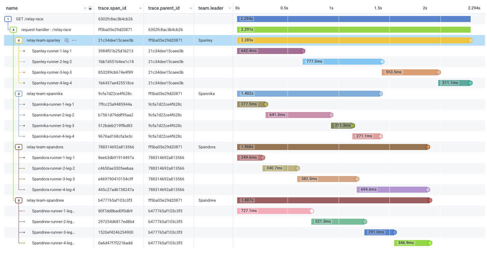
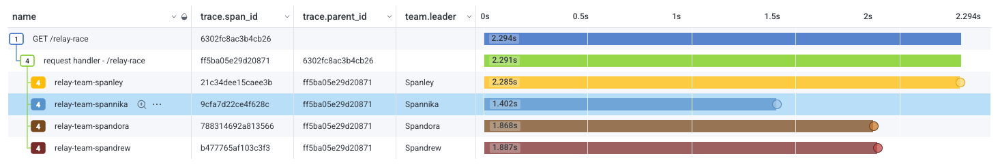

# Life of a Span

## Setup

### Prerequisites

- Node.js <= 22.6 (most testing done with v20.6).
- Docker ([alt if needed](#alternative-to-docker))

If using [Honeycomb](https://ui.honeycomb.io/signup), get a Honeycomb API Key (Ingest key preferred).

```sh
# set Honeycomb API Key
export HONEYCOMB_API_KEY="mykey"
```

## Run the Collector

Run the OTel Collector in Docker.
The Collector config file uses the `HONEYCOMB_API_KEY` environment variable to send to Honeycomb US instance.
This collector also saves spans to a local file called `data.json` using File Exporter, and shows spans in the Collector logs themselves using Debug Exporter.

```sh
# start the collector
docker run -d --rm \
  --name collector \
  -e HONEYCOMB_API_KEY=${HONEYCOMB_API_KEY} \
  -p 4317-4318:4317-4318 \
  -v $(pwd)/otel_collector_config.yaml:/etc/otelcol/config.yaml \
  -v $(pwd):/var/lib \
  ghcr.io/open-telemetry/opentelemetry-collector-releases/opentelemetry-collector:latest
```

## Run the app

The Node.js app builds during the start script, and imports OpenTelemetry in code.
The NodeSDK is initialized in `tracing.ts`, which is imported into `index.ts`.
The app is using the default setup for NodeSDK, which is an OTLP Traces Exporter with http/protobuf protocol and a BatchSpanProcessor, sending to `http://localhost:4318/v1/traces` where the collector is listening and receiving telemetry.

```sh
# generate stable http semconv
export OTEL_SEMCONV_STABILITY_OPT_IN="http"
# start the app
npm start
```

When the app is started, open a new terminal and hit the endpoint to generate telemetry.

```sh
# in a separate terminal, hit the endpoint
curl localhost:3000/hello
```

The traces are sent to the Collector where it exports to three places:

- Honeycomb (if API key is setup)
- `data.json` file
- Collector logs




## Teardown

Stop the Node.js app and stop the Collector:

```sh
# ctrl+c to stop the node app

# stop the collector
docker stop collector
```

Celebrate!

## Alternative to Docker

If running in Docker is not possible or not preferred, another option is just to run the Node.js app on its own.
Set environment variables to send to Honeycomb (if desired), or enable diagnostic logging in `tracing.ts` or via environment variable to view in console (along with other debugging logs).

```sh
# set Honeycomb API Key
export HONEYCOMB_API_KEY="mykey"
# generate stable http semconv
export OTEL_SEMCONV_STABILITY_OPT_IN="http"
# for default OTLP Exporter
export OTEL_EXPORTER_OTLP_ENDPOINT="https://api.honeycomb.io:443" # US instance
export OTEL_EXPORTER_OTLP_HEADERS="x-honeycomb-team=${HONEYCOMB_API_KEY}"

# for debugging logs and console exporter
export OTEL_LOG_LEVEL=debug
```
